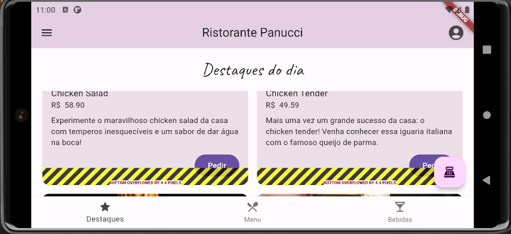

# Desenvolvendo layouts responsivos com Flutter   

Este projeto é fruto do curso de 'Flutter : aplicando constrains e implementando layouts responsivos' da plataforma ALURA

Continuação de um aplicativo 'panucci_ristorante' de cardápio iniciado onde o objetivo foi complementar as paginas para

- Rever o pedido que foi feito;
- Alterar a quantidade de cada item ou removê-lo da lista;
- Escolher a forma de pagamento, como cartão ou dinheiro;
- Realizar o pedido e o pagamento;

 Nesseçario complementar o desenvolvimento baseando-se no arquivo figma disponibilizado

[Link para o design no Figma](https://www.figma.com/file/NUkj8R3K3m19OhZD9x4Xwo/Ristorante-Panucci?type=design&node-id=0-1&mode=design&t=nLc3jye7qwFfxG3y-0)

## Projeto inicial 
 
     Aqui temos app bar e o bottom navigation bar e os demais compomentes que serão necessários  
 
      - Contador (counter_component.dart);
      - Cartão de bebidas (drink_item.dart);
      - Cartão de comidas (food_item.dart);
      - Cartão de destaque (highlight_item.dart);
      - Drawer, que é o menu lateral que já está montado, e abre ao clicarmos 
      no ícone de menu da app bar (main_drawer.dart);
      - Cartão da seção de pagamento (order_item.dart);
      - Tipos de pagamento (payment_method.dart);
      - Total de pagamento (payment_total.dart);
  
 

  
   

  

## desenvolvimento das Telas 

### Os comentários do desenvolvimento encontrasse dentro de cada update do código

 

  
  

### Tela destaque (HighLiths)
 
 

  
  
     

 

### Tela menu (FoodMenu)
 

<table style="width: 100%; border-collapse: collapse;" border="0">
  <tr>
    <td style="width: 25%; border: none;"> </td>
    <td style="width: 25%; border: none;"></td>
    <td style="width: 25%; border: none;"></td>
    <td style="width: 25%; border: none;"></td>
  </tr>
</table>

### Tela Drinks (DrinkMenu)

 <table style="width: 100%; border-collapse: collapse;" border="0">
  <tr>
      <td style="width: 25%; border: none;"> </td>
      <td style="width: 25%; border: none;"> </td>
      <td style="width: 25%; border: none;"> </td>
      <td style="width: 25%; border: none;"> </td>
  </tr>
</table>

 ### Tela checkout (Checkout)

 <table style="width: 100%; border-collapse: collapse;" border="0">
  <tr>
      <td style="width: 25%; border: none;"> </td>
      <td style="width: 25%; border: none;"> </td>
      <td style="width: 25%; border: none;"> </td>
      <td style="width: 25%; border: none;"> </td>
       
  </tr>
</table>
   
    
 
 ## Responsividade das telas (Modo Landscape)

  - Devido as telas terem sido desenvolvidos em modo 'Portrait' algumas telas tiveram que ser revisadas ao serem colocadas em modo 'Landscape'

### Tela bebidas (DrinkMenu)

 <table style="width: 100%; border-collapse: collapse;" border="0">
  <tr>
      <td style="width: 25%; border: none;"> </td>
  </tr>
  <tr>     
      <td style="width: 25%; border: none;"> </td>
  </tr>
  <tr>     
      <td style="width: 25%; border: none;"> </td>
    </tr> 
    <tr>   
      <td style="width: 25%; border: none;"> </td>
       
  </tr>
</table>

### Tela destaque (HighLiths)
  
 <table style="width: 100%; border-collapse: collapse;" border="0">
  <tr>
      <td style="width: 25%; border: none;"> </td>
  </tr>
  <tr>     
      <td style="width: 25%; border: none;"> </td>
  </tr>
      <tr>   
      <td style="width: 25%; border: none;"> </td>
       
  </tr>
</table>
 

